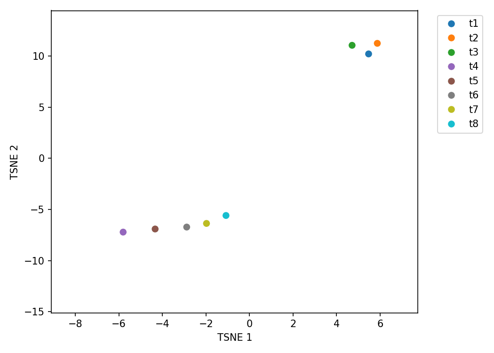

# Differentiable t-SNE for Sensitivity and Uncertainty Analysis

[](https://www.gnu.org/licenses/gpl-3.0)

> 💡 **Animations from the Dissertation**
>
> The key result animations from the accompanying dissertation can be found at the following links:
>
> - [Animation for M145 Dataset](dissertation/datasets/Scoelicolor/results/M145/animation_new.gif)
> - [Animation for M145 (30 Timepoints) Dataset](dissertation/datasets/Scoelicolor/results/M145_30_timepoints/animation.gif)

This repository provides a JAX-based implementation to analyze the stability and uncertainty of t-SNE embeddings. While standard t-SNE provides a powerful way to visualize high-dimensional data, the resulting embedding is often treated as a "black box." This work allows you to look inside that box by computing:

1.  **Sensitivity (Jacobian):** How does the low-dimensional embedding (`Y`) change in response to small perturbations in the high-dimensional input data (`X`)?
2.  **Uncertainty Propagation (Covariance):** If there is uncertainty in the input data, how does that uncertainty propagate to the final embedding?

This is achieved by leveraging the **implicit function theorem** and the automatic differentiation capabilities of **JAX**, allowing for efficient computation of these quantities without needing to differentiate through the entire t-SNE optimization process.

## Key Features

-   **Sensitivity Analysis:** Compute the full Jacobian matrix (`dY/dX`) of the t-SNE embedding. This tells you how each point in the embedding moves when any input point is perturbed.
-   **Uncertainty Propagation:** Propagate the covariance of the input data (`Cov(X)`) to the output embedding (`Cov(Y)`), quantifying the stability of each embedded point.
-   **High Performance:** Built on JAX for JIT-compilation, vectorization (`vmap`), and execution on GPU/TPU.
-   **Efficient Derivatives:** Uses analytical gradients and implicit differentiation to avoid costly backpropagation through the t-SNE optimization loop.

## Core Concepts

The t-SNE embedding `Y*` is the result of an optimization process that minimizes the KL divergence between high-dimensional similarities `P` and low-dimensional similarities `Q`. This means `Y*` is implicitly defined as the point where the gradient of the cost function is zero:

$$ \nabla_Y KL(X, Y^*) = 0 $$

Instead of differentiating through the optimizer that finds `Y*`, we can directly differentiate this equilibrium condition with respect to `X` using the **implicit function theorem**. This leads to an analytical expression for the Jacobian `J = dY*/dX`:

$$ J = - (\mathbf{H}_{YY})^{\dagger} \mathbf{J}_{YX} $$

where:
-   $\mathbf{H}_{YY}$ is the Hessian of the KL divergence with respect to the embedding `Y`.
-   $\mathbf{H}_{YY}^\dagger$ is the pseudoinverse of the Hessian.
-   $\mathbf{J}_{YX}$ is the mixed partial derivative of the KL gradient with respect to `X`.

This library calculates `J` efficiently using JAX's `vjp` (vector-Jacobian products) and `jvp` (Jacobian-vector products).

Once the Jacobian `J` is known, we can perform two key analyses:

1.  **Sensitivity:** The Jacobian `J` itself represents the local sensitivity of the embedding.
2.  **Uncertainty Propagation:** Given a covariance matrix for the input data `Cov(X)`, the output covariance can be approximated via a first-order Taylor expansion:
    
$$ Cov(Y) \approx J \cdot Cov(X) \cdot J^T $$

## Installation

1.  **Clone the repository:**
    ```bash
    git clone https://github.com/Integrative-Transcriptomics/tsne.git
    cd tsne
    ```

2.  **Create and activate a virtual environment (recommended), for example using miniconda ([see instructions](https://docs.conda.io/projects/conda/en/latest/user-guide/tasks/manage-environments.html#)):**
    ```bash
    conda create --name <my-env>
    ...
    ```

3.  **Install the required packages:**
    The project depends on `jax`, `openTSNE`, and `scikit-learn`.
    ```bash
    conda install [required packages]
    pip install [required packages]
    ```
    **Note on JAX:** For GPU or TPU support, please follow the official [JAX installation instructions](https://docs.jax.dev/en/latest/installation.html) to install the correct version for your CUDA drivers.

## Usage Example

The main functions can be found in `dissertation/tsne_jax.py`: `compute_sensitivities`, `compute_cov`, and `compute_cov_without_kronecker`, which take a pre-computed t-SNE embedding as input. You can generate this using any standard library like `openTSNE` or `scikit-learn`.

The `example.ipynb` notebook provides a complete walkthrough. Here is a minimal code snippet:

```python
import jax.numpy as np
from sklearn.datasets import make_blobs

# Import the core functions from our library
from tsne_jax import *
from jax.flatten_util import ravel_pytree

# 1. Generate sample data and a standard t-SNE embedding
X, labels = make_blobs(n_samples=150, n_features=10, centers=3, random_state=42)

# Generate random initialization for t-SNE
y_guess = random.normal(key, shape=(X_array.shape[0], 2))

# Use openTSNE to get a high-quality initial embedding
Y = tsne_fwd(X, y_guess)

# 2. Prepare data for our JAX functions
# The functions operate on flattened arrays for compatibility with JAX's derivatives
X_flat, X_unflattener = ravel_pytree(X)
Y_flat, Y_unflattener = ravel_pytree(Y)

# Define an example input covariance (e.g., identity matrix)
# This assumes independent and equal variance for all input features
input_cov = np.identity(X_flat.shape[0])

# 3. Compute sensitivities (the Jacobian dY/dX)
# This may take a few minutes depending on your hardware and data size
sensitivities = compute_sensitivities(X_flat, Y_flat, X_unflattener, Y_unflattener, perplexity=30.0)
print(f"Sensitivity matrix (dY/dX) shape: {sensitivities.shape}")

# 4. Compute output covariance
# This propagates the input_cov through the learned t-SNE manifold
output_covariance = compute_cov_without_kronecker(X_flat, Y_flat, X_unflattener, Y_unflattener, input_cov, perplexity=30.0)
print(f"Output covariance matrix shape: {output_covariance.shape}")

# 5. Visualize the results (see example.ipynb for plotting code)
# - the sensitivities can be visualized as a heatmap
# - The sensitivity vectors can be plotted on the t-SNE map to show how 
#   points move in response to perturbations.
# - The output covariance matrix can be used to define a Gaussian 
#   distribution, which can be visualized using hypothetical outcome 
#   plots.
# - The diagonal of the output covariance can be used to draw 
#   uncertainty
#   ellipses around each point in the embedding.
```

### Visualizing Results

The `example.ipynb` notebook shows how to visualize these outputs. For instance, the embedding stability can be visualized using **hypothetical outcome plots**:

<p align="center">
  
</p>

## Repository Structure

-   `dissertation/tsne_jax.py`: The core library file containing all JAX functions for re-implementing t-SNE's cost function and computing derivatives via the implicit function theorem.
-   `dissertation/utils.py`: Useful functions for visualizations.
-   `dissertation/example.ipynb`: A Jupyter Notebook demonstrating the full workflow from data generation to computing and visualizing sensitivities and covariance.
-   `requirements.txt`: A list of Python dependencies.

## Citation

If you use this work in your research, please consider citing it.

## License

This project is licensed under the GNU General Public License v3.0. See the LICENCE file for details.

## Contributing

Contributions, issues, and feature requests are welcome. Please feel free to open an issue to discuss your ideas.